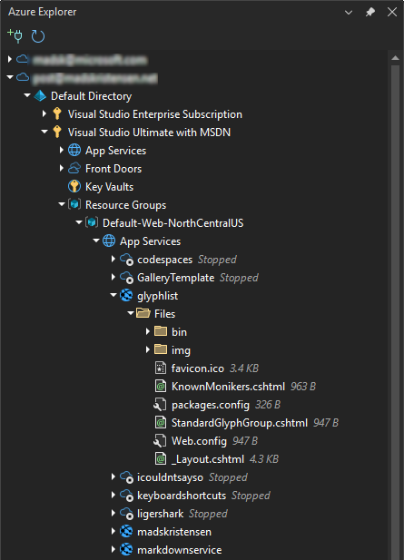
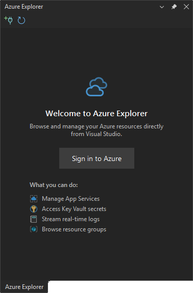

[marketplace]: <https://marketplace.visualstudio.com/items?itemName=MadsKristensen.AzureExplorer>
[vsixgallery]: <http://vsixgallery.com/extension/AzureExplorer.5e5465aa-805e-4395-b20d-a439f7c92ca1/>
[repo]: <https://github.com/madskristensen/AzureExplorer>

# Azure Explorer for Visual Studio

**Your Azure resources, right inside Visual Studio.** No Portal tab-switching. No context loss. Just code and cloud, together.

Download from the [Visual Studio Marketplace][marketplace] or get the latest [CI build][vsixgallery].

> **Requires Visual Studio 2026** or later on Windows 10+

---

## Miss the old Cloud Explorer?

When Microsoft removed **Cloud Explorer** from Visual Studio, many developers lost a crucial workflow. Azure Explorer brings it back — rebuilt from the ground up with modern authentication, better performance, and features Cloud Explorer never had.

**Built by [Mads Kristensen](https://github.com/madskristensen)**, a Microsoft developer and author of some of Visual Studio's most popular extensions (Web Essentials, Markdown Editor, Editor Enhancements, and 100+ more).

## What Can You Do?

| | |
|---|---|
| 🚀 **Deploy & Debug Faster** | Stream live logs, browse deployed files, drag-and-drop upload — without leaving your code |
| 🔍 **Find Anything Instantly** | Search across all subscriptions with `tag:Environment=Production` syntax |
| 🔐 **Manage Secrets Securely** | View, edit, and copy Key Vault secrets without touching the Azure Portal |
| 💻 **Connect to VMs** | One-click RDP/SSH connections to your Virtual Machines |
| 📦 **Browse Storage** | Navigate blob containers, upload files, copy connection strings |

## Supported Resources

| Resource Type | Key Actions |
|---------------|-------------|
| **App Services & Function Apps** | Browse, Start/Stop/Restart, Stream Logs, File Browser, Drag & Drop Upload |
| **Virtual Machines** | Start/Stop/Restart, Connect via RDP/SSH, Copy IP Address |
| **Storage Accounts** | Copy Connection String, Browse Blobs/Queues/Tables, Upload/Download |
| **Key Vaults** | Manage Secrets/Keys/Certificates |
| **SQL Servers & Databases** | Copy Connection String, Browse Databases |
| **Front Door** | Browse Endpoints |

*More resource types coming soon!*

📖 **[Full Documentation](https://github.com/madskristensen/AzureExplorer/blob/master/docs/index.md)** — Detailed guides, troubleshooting, and tips.

## Get Started in 30 Seconds

1. **Install** from the [Visual Studio Marketplace][marketplace]
2. **Open** via **View → Azure Explorer**
3. **Sign in** with your Azure account (uses Windows native authentication)
4. **Explore** — your subscriptions appear automatically

## Keyboard Shortcuts

| Shortcut | Action |
|----------|--------|
| `Ctrl+Alt+P` | Open selected resource in Azure Portal |
| `F5` | Refresh current view |
| `Enter` | Expand/collapse or execute default action |
| `Delete` | Delete selected item (with confirmation) |

## FAQ

**Q: Which Azure accounts are supported?**  
A: Personal Microsoft accounts, work/school (Entra ID), and accounts with multiple tenants. Uses Windows native authentication (WAM) for secure, seamless sign-in.

**Q: Why don't I see all my subscriptions?**  
A: Check if you're signed into the correct account. You can also hide/show subscriptions via right-click. See [Authentication docs](https://github.com/madskristensen/AzureExplorer/blob/master/docs/authentication.md) for details.

**Q: Is my data secure?**  
A: Azure Explorer never stores credentials. It uses your existing Visual Studio/Windows Azure credentials with Microsoft's authentication libraries. All API calls go directly to Azure.

**Q: Can I use this with Azure Government or other sovereign clouds?**  
A: Not currently, but it's on the roadmap. [Open an issue][repo] if this is important to you.

📖 See [FAQ](https://github.com/madskristensen/AzureExplorer/blob/master/docs/faq.md) and [Troubleshooting](https://github.com/madskristensen/AzureExplorer/blob/master/docs/troubleshooting.md) for more.

## Works Great With

These extensions complement Azure Explorer for a complete Azure development experience:

- **[Azure Functions](https://marketplace.visualstudio.com/items?itemName=ms-azuretools.vscode-azurefunctions)** — Develop and deploy serverless functions
- **[SQL Server Data Tools](https://learn.microsoft.com/en-us/sql/ssdt/)** — Database development and deployment
- **[Cloud Sync](https://marketplace.visualstudio.com/items?itemName=MadsKristensen.CloudSync)** — Sync VS settings across machines

## Contributing

This is a passion project, and contributions are welcome!

- 🐛 **Found a bug?** [Open an issue][repo]
- 💡 **Have an idea?** [Start a discussion][repo]
- 🔧 **Want to contribute?** Pull requests are always welcome

**If Azure Explorer saves you time**, consider:
- ⭐ [Rating it on the Marketplace][marketplace]
- 💖 [Sponsoring on GitHub](https://github.com/sponsors/madskristensen)

## License

[Apache 2.0](LICENSE.txt)
