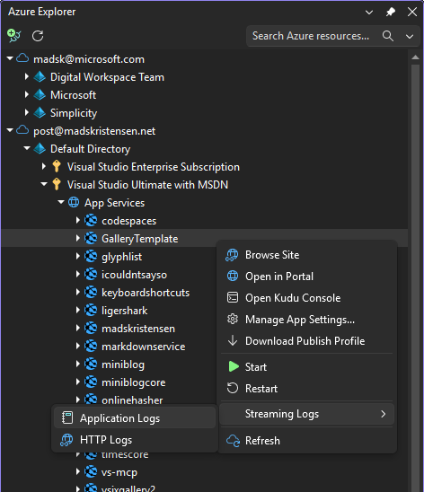

# App Services & Function Apps

Take control of your web apps and functions without leaving your code.

## Actions

| Action | Description |
|--------|-------------|
| **Browse** | Launch your site in the default browser |
| **Start / Stop / Restart** | Manage app lifecycle with safety confirmations |
| **Stream Logs** | Watch application and HTTP logs in real-time |
| **Portal** | Jump directly to the Azure Portal blade |
| **Kudu** | Access advanced diagnostics and console |
| **Download Publish Profile** | Get deployment credentials |
| **Manage App Settings** | View and edit configuration |
| **File Browser** | Browse and edit files in your wwwroot folder |
| **Drag & Drop Upload** | Upload files and folders directly from File Explorer or Solution Explorer |
| **Add Tags** | Organize with resource tags |

## File Management

Expand the "Files" node under any App Service or Function App to:

- **Browse Files** — Explore your wwwroot folder
- **Edit Files** — Double-click any file to open it in Visual Studio
- **Upload Files** — Drag files or folders from Windows File Explorer or Solution Explorer
- **Delete Files** — Right-click files or folders to delete them

See [File Browser](../features/file-browser.md) for more details.

## Log Streaming

Stream real-time application logs directly in Visual Studio:

1. Right-click your App Service or Function App
2. Select **"Stream Logs"**
3. A new tool window opens showing live log output
4. Generate activity in your app to see logs appear

**Tip:** Enable Application Logging in Azure Portal first (see Troubleshooting below).

## Required Permissions

| Action | Minimum Role |
|--------|--------------|
| View App Service | Reader |
| Start / Stop / Restart | Contributor |
| View App Settings | Contributor |
| Edit App Settings | Contributor |
| Upload Files (Kudu) | Contributor |
| Stream Logs | Reader + App Logging enabled |

## Troubleshooting

### Logs not appearing

1. **Enable Application Logging** in Azure Portal:
   - Go to your App Service → **Monitoring** → **App Service logs**
   - Set **Application Logging (Filesystem)** to **On**
   - Set the log level (Verbose for most detail)

2. **Generate activity** — Logs only appear when your app writes them. Make requests to your app.

3. **Check log level** — If set to "Error", you won't see Info/Warning messages.

### Can't start/stop the app

- Verify you have **Contributor** role on the App Service
- Check if the App Service Plan is in a stopped state
- Look for deployment locks on the resource

### File upload fails

- Ensure you have **Contributor** role
- Check if the app is running (Kudu requires a running app)
- Verify the app isn't in a read-only state

## Azure Documentation

- [App Service overview](https://learn.microsoft.com/en-us/azure/app-service/overview)
- [Azure Functions overview](https://learn.microsoft.com/en-us/azure/azure-functions/functions-overview)
- [Enable diagnostics logging](https://learn.microsoft.com/en-us/azure/app-service/troubleshoot-diagnostic-logs)
- [Kudu service overview](https://learn.microsoft.com/en-us/azure/app-service/resources-kudu)
- [Configure app settings](https://learn.microsoft.com/en-us/azure/app-service/configure-common)

## See Also

- [File Browser](../features/file-browser.md)
- [Resource Tags](../features/tags.md)
- [Troubleshooting](../troubleshooting.md)
