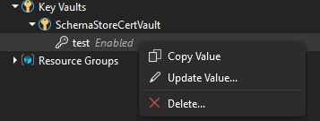

# Key Vaults

Securely manage your secrets, keys, and certificates.

## Secrets

| Action | Description |
|--------|-------------|
| **Add Secret** | Create new secrets directly from VS |
| **Update Value** | Modify existing secret values |
| **Copy Value** | One-click copy to clipboard |
| **Delete** | Remove secrets with confirmation |

## Keys

| Action | Description |
|--------|-------------|
| **Copy Key ID** | Copy the full key identifier URL |
| **Open in Portal** | Jump to the key in Azure Portal |

## Certificates

| Action | Description |
|--------|-------------|
| **Copy Certificate ID** | Copy the full certificate identifier URL |
| **View Expiration** | See certificate expiry dates at a glance |
| **Open in Portal** | Jump to the certificate in Azure Portal |

## See Also

- [Resource Tags](../features/tags.md)
